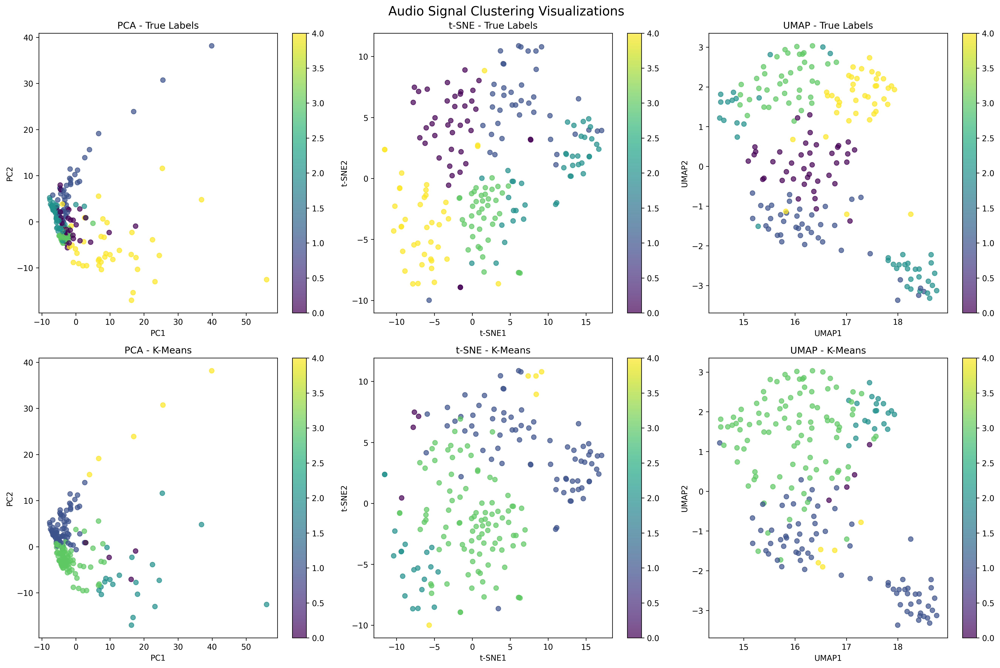
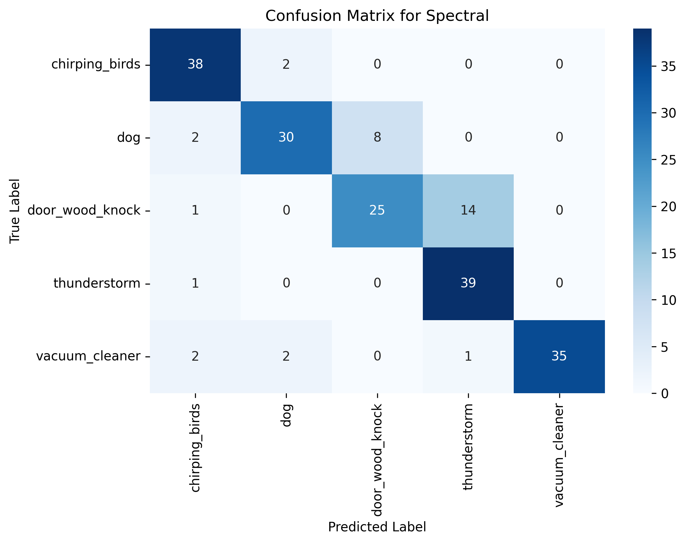
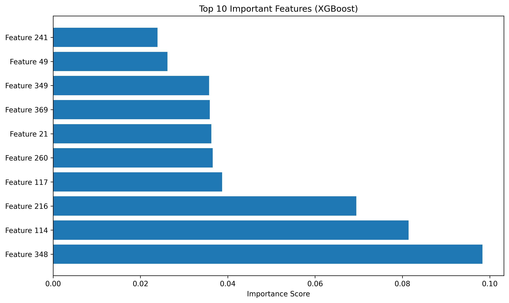

# Audio Pattern Recognition Engine (APRE)

A comprehensive audio analysis framework that combines advanced feature extraction, dimensionality reduction, clustering algorithms, and supervised learning for audio pattern recognition.

## Features

- **Advanced Audio Feature Extraction**: MFCC, spectral features, chroma, tonnetz, mel-spectrogram, wavelet features
- **Dimensionality Reduction**: PCA, t-SNE, UMAP, LDA
- **Clustering Algorithms**: K-Means, DBSCAN, Gaussian Mixture Models, Spectral Clustering, HDBSCAN
- **Deep Learning Models**: Autoencoders, CNN, Deep Embedded Clustering (DEC)
- **Supervised Learning**: MLP, XGBoost
- **Comprehensive Evaluation**: Multiple metrics and visualizations
- **Hardware Acceleration**: GPU support for compatible algorithms

## Installation

### Option 1: Virtual Environment Setup

> **Note**: TensorFlow for macOS requires Python < 3.12. If you are on a newer Python version, consider using `conda` or installing a compatible Python version (e.g., 3.9-3.11).


1. Create and activate a virtual environment:
```bash
python -m venv apre_env
source apre_env/bin/activate  # On Windows: apre_env\Scripts\activate
```

2. Install dependencies:
```bash
pip install -r requirements.txt
```

### Option 2: Development Installation

```bash
pip install -e .
```

## Usage

### Basic Usage

Run the complete APRE pipeline:

```bash
python main.py
```

### Ouput

```
(apre_env) (base) rajababu@Rajas-MacBook-Air apre-core % python main.py
Starting Audio Pattern Recognition Engine (APRE)
==================================================
Detected accelerators: {'has_cuda_gpu': False, 'mps_available': False, 'gpu_devices': []}

1. Loading ESC-50 Dataset...
ESC-50 data already exists, skipping download.
ESC-50 metadata loaded: 2000 clips
Available categories: ['sheep', 'dog', 'crackling_fire', 'pig', 'car_horn', 'water_drops', 'cat', 'breathing', 'mouse_click', 'door_wood_creaks', 'door_wood_knock', 'brushing_teeth', 'siren', 'airplane', 'sneezing', 'train', 'glass_breaking', 'clapping', 'cow', 'helicopter'] ...
Selected classes for this run: ['dog', 'chirping_birds', 'vacuum_cleaner', 'thunderstorm', 'door_wood_knock']
Number of clips selected: 200

2. Extracting Advanced Audio Features...
Extracting advanced features (sequential processing to avoid segfaults)...
Processing audio files: 100%|███████████████████████████████████████████████████████████████████████████████████████████████████████████████████| 200/200 [00:52<00:00,  3.78it/s]
Feature matrix shape: (200, 437)
Classes: ['chirping_birds' 'dog' 'door_wood_knock' 'thunderstorm' 'vacuum_cleaner']

3. Applying Dimensionality Reduction...
Applying dimensionality reduction techniques...
PCA reduced to 69 components (svd_solver='auto')
t-SNE perplexity set to 30
OMP: Info #276: omp_set_nested routine deprecated, please use omp_set_max_active_levels instead.

4. Creating Autoencoder Representation...

5. Applying Clustering Algorithms...
Clustering with multiple algorithms...

6. Applying Deep Embedded Clustering...

7. Training Supervised Learning Models...
XGBoost configured for CPU.

8. Training CNN Model...
WARNING:tensorflow:5 out of the last 15 calls to <function TensorFlowTrainer.make_predict_function.<locals>.one_step_on_data_distributed at 0x16d347d80> triggered tf.function retracing. Tracing is expensive and the excessive number of tracings could be due to (1) creating @tf.function repeatedly in a loop, (2) passing tensors with different shapes, (3) passing Python objects instead of tensors. For (1), please define your @tf.function outside of the loop. For (2), @tf.function has reduce_retracing=True option that can avoid unnecessary retracing. For (3), please refer to https://www.tensorflow.org/guide/function#controlling_retracing and https://www.tensorflow.org/api_docs/python/tf/function for  more details.
WARNING:tensorflow:6 out of the last 16 calls to <function TensorFlowTrainer.make_predict_function.<locals>.one_step_on_data_distributed at 0x16d347d80> triggered tf.function retracing. Tracing is expensive and the excessive number of tracings could be due to (1) creating @tf.function repeatedly in a loop, (2) passing tensors with different shapes, (3) passing Python objects instead of tensors. For (1), please define your @tf.function outside of the loop. For (2), @tf.function has reduce_retracing=True option that can avoid unnecessary retracing. For (3), please refer to https://www.tensorflow.org/guide/function#controlling_retracing and https://www.tensorflow.org/api_docs/python/tf/function for  more details.

9. Evaluating Results...

===== RESULTS SUMMARY =====
Selected classes: ['chirping_birds' 'dog' 'door_wood_knock' 'thunderstorm' 'vacuum_cleaner']

📊 Metric Explanations:
• Accuracy: Classification accuracy (higher = better)
• ARI: Adjusted Rand Index for clustering (higher = better, max=1)
• NMI: Normalized Mutual Information for clustering (higher = better, max=1)
• Silhouette: Cluster quality measure (higher = better, range=-1 to 1)
• N/A: Metric not applicable to this algorithm type

🎯 CLUSTERING METHODS (Unsupervised):
                    Accuracy     ARI     NMI Silhouette
K-Means               0.5000  0.2213  0.3582   0.099059
DBSCAN                0.0000  0.0000  0.0000         -1
GMM                   0.6100  0.3505  0.4812        N/A
Spectral              0.8350  0.6598  0.7108        N/A
HDBSCAN               0.6818  0.2139  0.2626   0.001709
UMAP+KMeans           0.8150  0.6133  0.6605   0.477684
Autoencoder+KMeans    0.4600  0.1553  0.2729   0.291201
DEC                   0.5000  0.2213  0.3582        N/A

🤖 SUPERVISED METHODS:
         Accuracy  Precision  Recall  F1-Score
MLP         0.925     0.9306   0.925    0.9229
XGBoost     0.925     0.9314   0.925    0.9244
CNN         0.625     0.7407   0.625    0.6318

📈 BEST PERFORMERS BY CATEGORY:
• Best Clustering Method: Spectral (83.5%)
• Best Supervised Method: MLP (92.5%)

==========================


10. Creating Visualizations...
Creating visualizations...
Saved clustering visualizations to clustering_visualizations.png
Saved confusion matrix to confusion_matrix.png
Saved feature importance plot to feature_importance.png
Analysis completed successfully!
Generated visualizations saved as PNG files in the current directory.
==================================================
```

## Configuration

Modify `config/config.py` to customize:

- Audio processing parameters
- Model hyperparameters
- File paths and output settings
- Visualization preferences

## Key Components

### Data Processing
- **ESC-50 Dataset**: Automatic download and preprocessing
- **Feature Extraction**: 280+ audio features per sample
- **Data Scaling**: StandardScaler normalization

### Machine Learning Models
- **Unsupervised**: K-Means, DBSCAN, GMM, Spectral, HDBSCAN
- **Deep Learning**: Autoencoders, CNN, DEC
- **Supervised**: MLP, XGBoost

### Evaluation Metrics
- **Clustering**: Accuracy, ARI, NMI, Silhouette Score
- **Classification**: Accuracy, Precision, Recall, F1-Score

### Visualizations
- Dimensionality reduction plots (PCA, t-SNE, UMAP)
- Clustering results visualization
- Confusion matrices
- Feature importance plots

## Hardware Requirements

- **CPU**: Multi-core processor recommended
- **RAM**: 8GB minimum, 16GB+ recommended
- **GPU**: Optional but recommended for neural network training
- **Storage**: 2GB+ for dataset and results

## Dependencies

Key libraries:
- `librosa`: Audio processing
- `scikit-learn`: Machine learning algorithms
- `tensorflow`: Deep learning models
- `umap-learn`: UMAP dimensionality reduction
- `hdbscan`: HDBSCAN clustering
- `matplotlib/seaborn`: Visualizations

See `requirements.txt` for complete list.

## Output Files

The system generates:
- `clustering_visualizations.png`: Comprehensive clustering plots
- `confusion_matrix.png`: Best method confusion matrix
- `feature_importance.png`: XGBoost feature importance
- Console output with detailed performance metrics

### Sample Visualizations

#### Clustering Analysis

*Comprehensive clustering results showing different algorithms' performance on dimensionally reduced audio features*

#### Classification Performance

*Confusion matrix for the best performing supervised learning method*

#### Feature Analysis

*XGBoost feature importance showing the most discriminative audio features*

## Performance Notes

- Uses sequential processing to avoid threading conflicts
- Implements fallback strategies for edge cases
- Optimized for stability over maximum performance
- Automatic parameter adjustment based on data size
